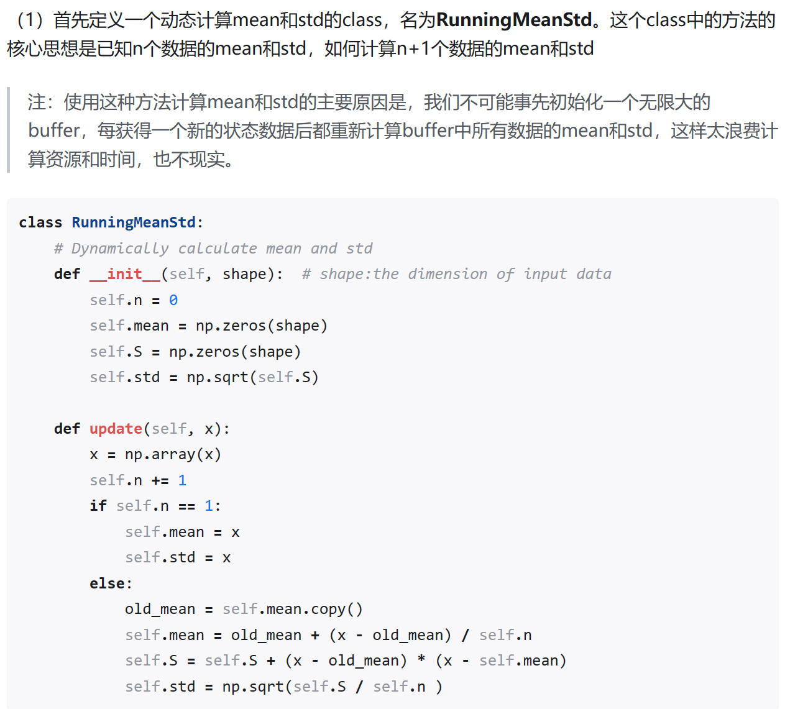
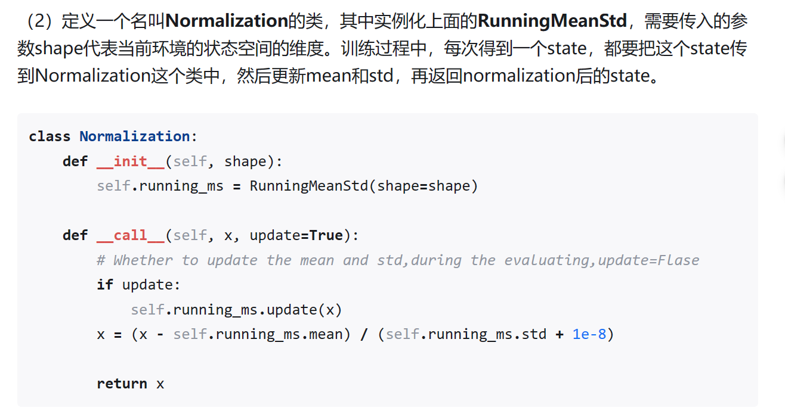
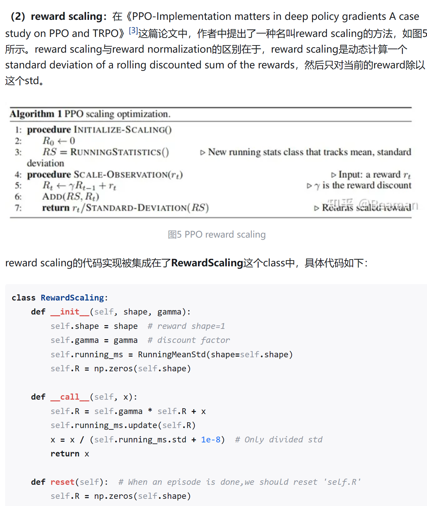
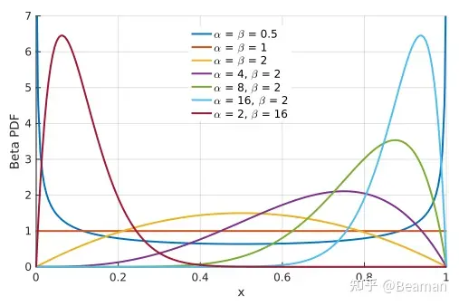

# PPO code experiment

This is a simple experiment to test the PPO algorithm on the OpenAI gym environment.

All code resource is from the repository: [Link1](https://github.com/Lizhi-sjtu/DRL-code-pytorch/tree/main), which is also inspired by a blog paper from [37 PPO Tricks](https://iclr-blog-track.github.io/2022/03/25/ppo-implementation-details/).

**Here, I'd like to split the code frame, and note what I have learned from the code.**

## Code Frame

- main.py
    - argparse, set the hyperparameter
    - tensorboard, log the training process
    - evaluate policy, test the policy
    - train policy, train the policy

- ppo_agent.py
    - Actor Module
        - its distrubution
        - network structure
    - Critic Module
        - network structure
    - PPO Agent
        - evaluate, return the deterministic action(mean)
        - choose_action, return the **sampled action** and its log probability
        - update, update the policy and value network when the replay buffer is full. Note that it can be updated multiple times in it since we use the IS ratio trick.
- ReplayBuffer
    - __init__, use np dtype to store
    - store, store the transition
    - numpy_to_tensorple, Once the buffer is full, "agent.update" will turn all the data in buffer to tensor, and then update the policy and value network.
- Normalization
    - RunningMeanStd, calculate the mean and std of the input data with dynamic method.
    - Normalization, a class which can normalize data to zero mean and unit variance.
    - RewardScaling, a trick to scale the reward to a proper range.(just divide the reward by std)

-----

## Trick explanation

In the following, I'll explain 12 tricks in the PPO algorithm. Some of them indeed works, but some are obscure to me, which means sometimes it works but sometimes it even reduces the performance.


-----

### 1. use GAE to estimate the advantage


make the advantage estimation more stable.

for more details, you can view my another blog post [RL_toolbox]()

--------

### 2. use the clipped IS ratio to update the policy


make the update more stable and avoid the large variance.


-------

### 3. Advantage Normalization

After we calculate all the advantage in a batch via GAE, we normalize the advantage to zero mean and unit variance.

**it indeed play an important role in the training process. Training almost cannot be completed without this trick!**


-----

### 4. State Normalization

The core of state normalization is to maintain a running mean and std of the state, and then normalize the state to zero mean and unit variance. Pay attention to that we need to dynamically update the mean and std of all the states.

After state normalization, the policy network can be trained more efficiently with the normalized state input.




-----

### 5. Reward Scaling

- by chatgpt:

在论文《PPO-Implementation matters in deep policy gradients: A case study on PPO and TRPO》中提出的reward scaling技术，通过动态计算回报的滚动折现和的标准差，并将当前奖励除以这个标准差进行缩放，具有以下优点：

1. **改善学习稳定性**：通过将奖励标准化，reward scaling有助于维持学习过程中的数值稳定性。这是因为缩放后的奖励通常会落在一个相对较小和更统一的数值范围内，减少了学习算法在面对极端或不同量级的奖励时的不稳定性。

2. **加快收敛速度**：标准化处理能够使得奖励信号更加一致，从而加速学习过程的收敛。缩放奖励意味着梯度更新可以在一个更加一致的尺度上进行，避免了因为奖励尺度问题导致的学习速度变慢。

3. **自适应调整**：与静态的奖励缩放方法不同，reward scaling根据实时计算的标准差动态调整奖励的缩放程度。这意味着它能够自适应不同环境和任务中奖励分布的变化，无需手动调整缩放因子。

4. **减少训练过程中的方差**：通过缩放奖励，这种方法有助于减少训练过程中策略梯度的方差。较低的方差可以提高策略更新的质量，从而提高整个训练过程的效率和可靠性。

5. **易于实现和集成**：作为一种预处理步骤，reward scaling相对简单，容易在现有的强化学习框架和算法中实现和集成。这使得它成为一种低成本且有效的方法，用于提升深度策略梯度方法的性能。

总的来说，reward scaling提供了一种有效的技术手段，通过动态调整奖励缩放程度，改善强化学习模型的训练稳定性、加速模型收敛，并提高训练过程的自适应性和效率。



----

### 6. Policy Entropy

we use entropy to represent the uncertainty of the policy. The entropy is used to encourage the policy to explore more in the environment.

In our code, when we get the distribution of the action (action_dim) from actor network, we can calculate the entropy of the action distribution by the following code:

```python

dist_entropy = dist_now.entropy().sum(1,keepdim=True)
actor_loss = -torch.min(surr1,surr2) - self.entropy_coef * dist_entropy

```

------

### 7. Learning Rate Decay

Learning rate decay can enhance the stability of the later stages of training to a certain extent. We here utilize the learning rate linear decay method.

```python

def lr_decay(self, total_steps):
    lr_a_now = self.lr_a * (1 - total_steps / self.max_train_steps)
    lr_c_now = self.lr_c * (1 - total_steps / self.max_train_steps)
    for p in self.optimizer_actor.param_groups:
        p['lr'] = lr_a_now
    for p in self.optimizer_critic.param_groups:
        p['lr'] = lr_c_now

```

-----


### 8. Gradient Clip

To prevent gradient explosion, we use the gradient clip trick.

```python
# Update actor
self.optimizer_actor.zero_grad()
actor_loss.mean().backward()
if self.use_grad_clip: # Trick 7: Gradient clip
    torch.nn.utils.clip_grad_norm_(self.actor.parameters(), 0.5)
self.optimizer_actor.step()

# Update critic
self.optimizer_critic.zero_grad()
critic_loss.backward()
if self.use_grad_clip: # Trick 7: Gradient clip
    torch.nn.utils.clip_grad_norm_(self.critic.parameters(), 0.5)
self.optimizer_critic.step()
```


-----

### 9. Orthogonal Initialization

To prevent gradient vanishing or explosion in the beginning of training, we use the orthogonal initialization trick.

I still query GPT for details of this trick.

正交初始化（Orthogonal Initialization）是一种常用于深度学习模型中的参数初始化方法，特别是在训练深层神经网络时。这种方法有几个显著的优点：

**优点有哪些?**

#### 1. 缓解梯度消失或爆炸问题

在深度神经网络中，梯度消失或爆炸是训练过程中常见的问题。正交初始化通过保持权重矩阵的正交性，有助于维持激活函数的输入在一个合理的范围内，这样可以有效地减少梯度消失或爆炸的问题，使得梯度更稳定地在网络中传播。

#### 2. 促进网络训练的稳定性

正交初始化能够促进网络训练过程的稳定性。由于初始化的权重矩阵是正交的，这有助于每层的输入保持独立性，减少了层间的相互干扰。这种独立性有助于稳定训练过程，特别是在训练深层网络时更是如此。

#### 3. 加速收敛

通过减少梯度消失和爆炸的问题，以及提高网络训练的稳定性，正交初始化有助于加速模型的收敛速度。网络参数的优良初始值可以让模型更快地达到较低的训练误差和泛化误差。

#### 4. 改善深层网络的性能

对于深层网络，正交初始化特别有利于提高其性能。深层网络因为层数多，梯度在反向传播时很容易受到消失或爆炸的影响，正交初始化通过维持权重的正交性，有助于梯度更平稳地通过网络的每一层，从而有助于提高深层网络的学习能力和最终的模型性能。

#### 5. 适用于多种网络结构

正交初始化不仅适用于全连接网络，也适用于卷积网络和循环神经网络等多种网络结构。特别是在循环神经网络（RNN）中，正交初始化可以有效地缓解梯度消失的问题，提高长期依赖的学习能力。

总之，正交初始化通过提供一种稳定且有效的方式来初始化网络权重，有助于改善训练过程的稳定性、加速模型的收敛，并提高深层网络的性能。

**为什么正交初始化可以缓解梯度消失或爆炸问题?**

正交初始化能够缓解梯度消失或爆炸问题的原因主要与深度神经网络中权重矩阵的乘积以及梯度传播有关。在深度神经网络的训练过程中，输入信号和梯度需要通过多层的权重矩阵传播。如果这些权重矩阵的初始化不当，它们的乘积很容易导致数值过大或过小，进而引起梯度爆炸或梯度消失问题。正交初始化通过确保权重矩阵的正交性，有助于控制这一问题：

#### 1. 保持信号范围

正交矩阵有一个重要的性质：它们的列（或行）向量互相正交且单位化（即长度为1）。这意味着，当数据通过一个用正交矩阵初始化的网络层时，输入信号的范数（或长度）被保持不变。因此，在理想情况下，正交初始化有助于在深度网络的各层之间保持激活值和梯度的规模，减少梯度消失或爆炸的风险。

#### 2. 促进梯度的稳定传播

在深度网络中，梯度通过反向传播算法从输出层传播回输入层。如果权重矩阵非正交，梯度在传播过程中可能会迅速增长或减少，导致爆炸或消失。由于正交矩阵保持了向量长度，这有助于梯度稳定地传播，即使网络很深。

#### 3. 减少内部协变量偏移

正交初始化还有助于减少训练过程中的内部协变量偏移，即网络中不同层激活分布的变化。由于正交初始化保持了输入信号的规模，它有助于使每一层的输入分布保持相对稳定，从而减轻训练初期的学习负担。

#### 4. 提高学习效率

由于梯度的稳定传播，网络可以更有效地学习，避免了因梯度消失导致的学习停滞，或因梯度爆炸导致的训练不稳定。这种效率的提高有助于加速收敛，提高模型性能。

总结而言，正交初始化之所以能够缓解梯度消失或爆炸问题，主要是因为它保持了深度网络中信号和梯度的规模，确保了训练过程中梯度的稳定传播，这对于深度网络的训练至关重要。


-----

### 10. Adam Optimizer Epsilon Parameter

we turn it from eps = 1e-8 to eps = 1e-5, which can make the training more stable.

----

### 11. Tanh Activate Function


Just use it. I don't know exactly why it works.

-----

### 12. Gaussian Distribution and Beta Distribution

In fact, we use Gaussian distribution to output the action most of time. But we need to clip the action to a proper range as Gaussian distribution is unbounded, which induce a negative effect on the performance.

We try to use Beta distribution to output action in a range of [0,1]. Then we can map [0.1] to any action range.




----

## Code details

If you want to know more about the code details, maybe you can read my another blog post [RL_Code_Details]() which analyze some code details. PPO code is included of course.